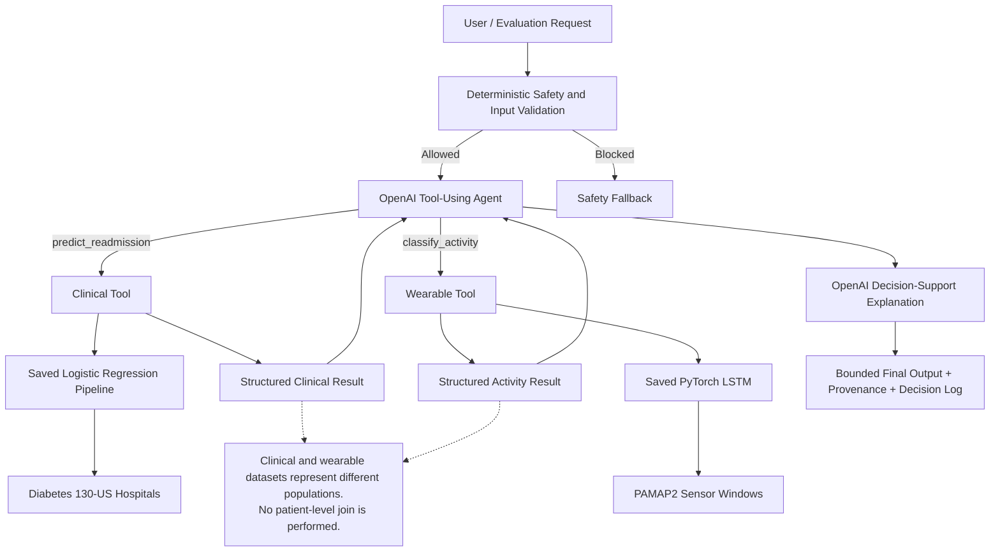

# Integrated Intelligent Health Monitoring and Clinical Decision Support System

## Overview

This capstone project is an integrated healthcare AI prototype that combines a clinical prediction pipeline, a wearable activity-recognition pipeline, a generative explanation layer, and an OpenAI-backed tool-using agent.

The system is designed as a **decision-support demonstration**, not as a diagnostic or treatment system. The two public datasets used in the project represent different populations and are never joined at the patient level. Integration occurs only at the application layer, where independently generated model outputs are presented together with explicit provenance and safety boundaries.

## Industry Problem

Healthcare organizations often analyze longitudinal clinical records and wearable sensor data in separate workflows. This prototype explores how these two types of AI outputs can be orchestrated within one transparent system while preserving data provenance, uncertainty, and human oversight.

The integrated system supports three bounded tasks:

- clinical 30-day readmission risk estimation;
- wearable physical activity recognition;
- integrated explanation of independent clinical and wearable model outputs.

## Public Datasets

### Diabetes 130-US Hospitals for Years 1999–2008

The clinical branch uses the public UCI Diabetes 130-US Hospitals dataset. It contains hospital encounter information for patients with diabetes and supports classification of early readmission.

Expected location:

```text
data/raw/diabetes/diabetic_data.csv
```

### PAMAP2 Physical Activity Monitoring

The wearable branch uses the public UCI PAMAP2 dataset. It contains multivariate wearable sensor measurements from nine participants performing multiple physical activities.

Expected location:

```text
data/raw/pamap2/
```

## System Architecture



## Repository Structure

```text
healthcare_capstone/
├── data/
│   ├── raw/
│   │   ├── diabetes/
│   │   └── pamap2/
│   └── processed/
├── notebooks/
│   ├── 01_diabetes_eda.ipynb
│   ├── 02_pamap2_eda.ipynb
│   ├── 03_readmission_model.ipynb
│   ├── 04_activity_model.ipynb
│   └── 05_system_evaluation.ipynb
├── src/
│   ├── preprocessing/
│   │   ├── diabetes.py
│   │   └── pamap2.py
│   ├── prediction/
│   │   └── readmission.py
│   ├── activity/
│   │   └── lstm.py
│   ├── generation/
│   │   └── explanation.py
│   └── agent/
│       ├── tools.py
│       ├── safeguards.py
│       └── health_agent.py
├── models/
│   ├── readmission_model.pkl
│   └── activity_model.pt
├── tests/
│   └── test_integrated_agent.py
├── diagrams/
├── reports/
├── config.yaml
├── requirements.txt
└── README.md
```

## Technical Components

### Clinical Prediction

The clinical pipeline:

1. loads the Diabetes dataset;
2. normalizes missing values;
3. creates a binary `<30` readmission target;
4. removes identifiers from predictive features;
5. groups high-cardinality diagnosis codes;
6. performs a patient-aware split to reduce leakage;
7. applies train-fitted preprocessing;
8. trains a Logistic Regression classifier;
9. saves the complete inference pipeline.

### Wearable Activity Recognition

The wearable pipeline:

1. loads PAMAP2 subject files;
2. removes transient activity ID `0`;
3. selects 19 heart-rate, accelerometer, and gyroscope channels;
4. handles missing sensor values;
5. creates 100-step windows with 50% overlap;
6. prevents windows from crossing subject or activity boundaries;
7. performs a subject-aware train/test split;
8. fits scaling only on training sequences;
9. trains a single-layer PyTorch LSTM;
10. saves the model and reconstruction metadata.

### OpenAI Agent

The OpenAI-backed agent:

- receives a bounded task request;
- passes deterministic safeguards before API/tool execution;
- uses OpenAI function calling to select the appropriate local tool;
- runs predictive models locally;
- sends only structured model outputs back to OpenAI;
- generates the final explanation;
- records a decision log for transparency.

Raw clinical records and sensor arrays are retained locally in the application workflow rather than being passed as function arguments to OpenAI.

## Safety Boundaries

The prototype intentionally does not:

- diagnose a medical condition;
- prescribe medication;
- recommend dosage or treatment selection;
- claim that wearable activity causes clinical readmission risk;
- treat the Diabetes and PAMAP2 datasets as records from the same people;
- make autonomous clinical decisions.

Explicit diagnosis, prescribing, dosage, and treatment-selection requests are blocked before predictive tools are executed.

## System Evaluation

`05_system_evaluation.ipynb` evaluates:

- clinical-only routing;
- wearable-only routing;
- integrated two-tool routing;
- provenance preservation;
- decision-support explanation behavior;
- safety fallback;
- invalid input handling;
- selected predictive failure cases.

A key evaluation principle is that **successful orchestration does not imply that every underlying prediction is correct**. Model errors are retained as evidence of system limitations rather than hidden by the agent.

## Setup

Create and activate a virtual environment, then install dependencies:

```bash
pip install -r requirements.txt
```

Create a project-root `.env` file:

```text
OPENAI_API_KEY=your_api_key
OPENAI_MODEL=gpt-4.1-mini
```

Never commit `.env`.

The `.gitignore` should include:

```text
.env
.venv/
__pycache__/
.ipynb_checkpoints/
```

## Recommended Execution Order

```text
01_diabetes_eda.ipynb
↓
src/preprocessing/diabetes.py
↓
03_readmission_model.ipynb
↓
src/prediction/readmission.py
↓
02_pamap2_eda.ipynb
↓
src/preprocessing/pamap2.py
↓
src/activity/lstm.py
↓
04_activity_model.ipynb
↓
src/generation/explanation.py
↓
src/agent/*
↓
05_system_evaluation.ipynb
```

## Testing

Run the end-to-end integration test from the project root:

```powershell
.\.venv\Scripts\python.exe tests\test_integrated_agent.py
```

The test covers:

- clinical tool routing;
- wearable tool routing;
- integrated two-tool routing;
- deterministic safety fallback.

## Reproducibility

After the implementation is final, regenerate dependencies from the working environment:

```bash
pip freeze > requirements.txt
```

The project uses fixed random seeds where applicable, saved model artifacts, explicit preprocessing modules, and participant/patient-aware data splitting to improve reproducibility.

## Responsible Use

This repository is a capstone prototype and is not validated for clinical deployment. Any real healthcare use would require substantially stronger clinical validation, fairness assessment, security/privacy review, monitoring, governance, regulatory review, and qualified human oversight.
