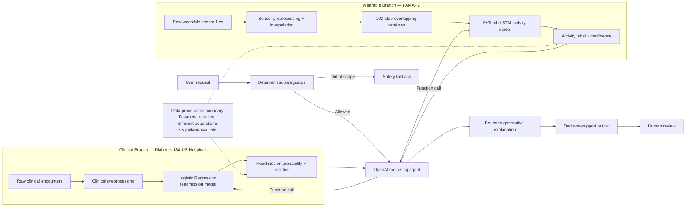

# System Architecture Diagram

The diagram below is architecture figure for the paper, README, and mentor presentation.

## Figure Caption

**Figure 1. Integrated Intelligent Health Monitoring and Clinical Decision Support System.** The architecture maintains separate clinical and wearable data pipelines, exposes each trained model as a bounded local tool, and uses an OpenAI-backed agent to select tools and synthesize structured outputs. The two datasets represent different populations; therefore, integration occurs only at the application layer and does not imply patient-level linkage or causation.
